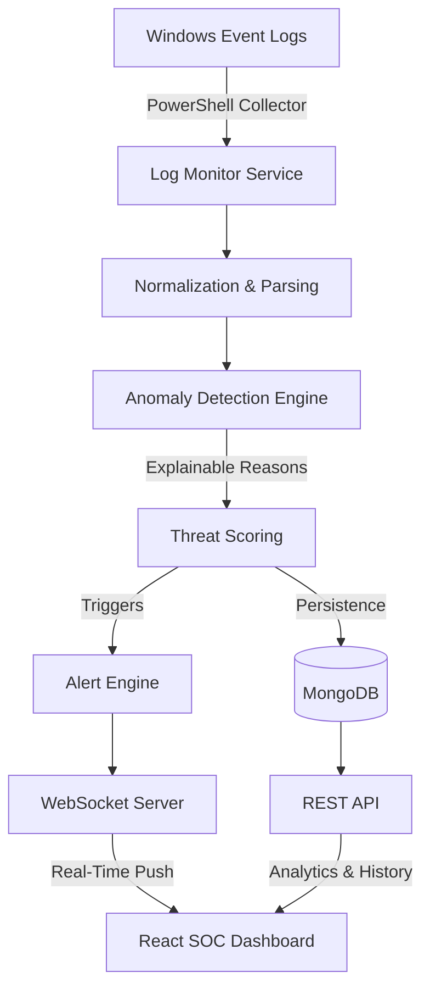

# IT System Log Analyzer — SOC Dashboard

A Real-Time Security Operations Center (SOC) dashboard and anomaly detection platform for Windows and Linux endpoint monitoring.

## Project Overview

The IT System Log Analyzer is designed to automatically ingest, normalize, and analyze system logs (such as Windows Event Logs) in real-time. It uses heuristic-based detection rules to identify malicious activity—such as brute force attacks, privilege escalation, and port scanning—and assigns explainable threat scores to active threats.

## Key Features

- **Real-Time Log Ingestion:** Continuously monitors Windows Event Logs (Security, System, Application) or Linux Syslog/Auth logs.
- **Explainable Anomaly Detection:** Deterministic threat scoring model with clear reasoning for every detected threat.
- **Live SOC Dashboard:** React-based command center featuring dark navy/charcoal aesthetics, dynamic KPI cards, and Recharts-powered analytics.
- **WebSocket Streaming:** Instant log delivery to the frontend UI without polling.
- **Interactive Alerts Investigation:** Dedicated drawer for analyzing related logs, IP addresses, and timelines of events.
- **System Health Monitoring:** Tracks backend Node.js performance, host OS metrics (CPU, RAM, load), and MongoDB connectivity.

## Architecture



## Technology Stack

**Frontend:**
- React (Vite)
- Tailwind CSS
- React Router DOM
- Recharts (Data Visualization)
- Lucide React (Iconography)

**Backend:**
- Node.js & Express
- MongoDB & Mongoose
- WebSocket (ws)
- Windows PowerShell Integration (`Get-WinEvent`)

## Detection Rules Engine

The platform includes built-in detection capabilities for:
1. **Brute Force Attacks:** Tracks failed logins across time windows (e.g., Windows Event ID 4625).
2. **Port Scanning:** Detects sequential connections to multiple ports.
3. **Privilege Escalation:** Flags sudo/su or specific high-severity commands.
4. **Admin Direct Login:** Flags direct authentication to root/administrator.
5. **Data Exfiltration:** Detects abnormal network tools usage.

## Installation & Setup

1. **Prerequisites:**
   - Node.js v18+
   - MongoDB (Local or Atlas)
   - Windows OS (for native Event Log monitoring, though Linux tailing is supported)

2. **Clone and Install:**
   ```bash
   # Install Backend Dependencies
   cd backend
   npm install

   # Install Frontend Dependencies
   cd ../frontend
   npm install
   ```

3. **Environment Variables:**
   Create a `.env` file in the `backend` directory:
   ```env
   PORT=5000
   MONGO_URI=mongodb://localhost:27017/log-analyzer
   CORS_ORIGIN=http://localhost:3000
   JWT_SECRET=your_super_secret_key
   ```

4. **Run the Platform:**
   Start the backend and frontend simultaneously (or use the provided start scripts):
   ```bash
   # Terminal 1: Backend
   cd backend
   npm start

   # Terminal 2: Frontend
   cd frontend
   npm run dev
   ```

## Security Considerations

- **API Security:** The backend is protected using `helmet` and `express-rate-limit`.
- **CORS:** Strictly configured via environment variables.
- **Role-Based Access (Pending Integration):** Foundation laid for Admin, Analyst, and Viewer JWT roles.

© 2026 IT System Log Analyzer
